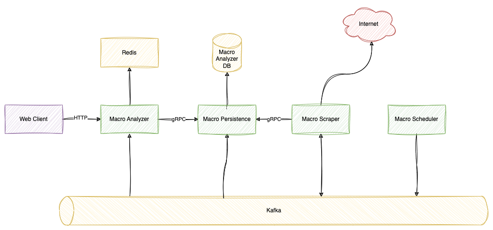

# macro-hub

Visualizing macro-economic trends and parameters.

### Set Up Guide

1. Start the docker database container
2. Create the database in the container
3. Run the backend application in IntelliJ
4. Install the frontend repo
5. Run the frontend repo
6. Run individual scrape queries below to populate the database

More details on the individual steps can be found below.

---

## marco-analyzer



### start docker database container

`docker run --name postgres-db -p 15432:5432 -e POSTGRES_PASSWORD=pgp -d postgres`

### create database

```
psql -h localhost -p 15432 -U postgres -W
CREATE DATABASE macroanalyzer;
CREATE USER macrouser WITH PASSWORD 'macropassword';
ALTER USER macrouser WITH SUPERUSER;
```

### generate jooq model

`mvn org.jooq:jooq-codegen-maven:3.18.5:generate`

### sources

- [Riskbanken REST API](https://www.riksbank.se/sv/statistik/sok-rantor--valutakurser/hamta-rantor-och-valutakurser-via-api/)
- [Riskbanken series](https://www.riksbank.se/sv/statistik/sok-rantor--valutakurser/oppet-api/serier-for-webbservices/)
- [Hexagonal architecture](https://medium.com/ssense-tech/hexagonal-architecture-there-are-always-two-sides-to-every-story-bc0780ed7d9c)
- [Commit message guidelines](https://gist.github.com/robertpainsi/b632364184e70900af4ab688decf6f53)

## macro-frontend

NextJS + react-chartjs-2

### Sources

- [react-chartjs-2 documentation](https://react-chartjs-2.js.org/components/line)
- [Tanstack Query](https://tanstack.com/query/latest)
