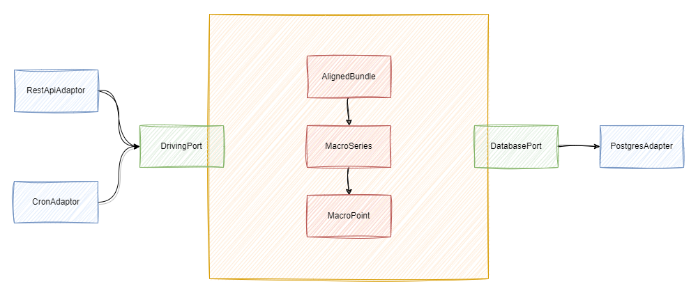

## marco-analyzer



### Build docker image

```
docker build -t macro-analyzer .
```

### Run docker image

```
docker run -e "SPRING_PROFILES_ACTIVE=prod -p 8080:8080 macro-analyzer
```

### scrape data

#### Queue all data to be scraped

```
curl.exe -X POST "localhost:8080/scrape/schedule-all?interval=minute&multiplier=5"
```

#### Scrape individual datasets

```
curl.exe -X POST "localhost:8080/scrape/policy-rate/sweden"
curl.exe -X POST "localhost:8080/scrape/exchange-rate/usd-sek"
curl.exe -X POST "localhost:8080/scrape/government-bills/sweden?period=1"
curl.exe -X POST "localhost:8080/scrape/government-bills/sweden?period=3"
curl.exe -X POST "localhost:8080/scrape/government-bills/sweden?period=6"
curl.exe -X POST "localhost:8080/scrape/government-bills/sweden?period=12"
curl.exe -X POST "localhost:8080/scrape/government-bonds/sweden?period=2"
curl.exe -X POST "localhost:8080/scrape/government-bonds/sweden?period=5"
curl.exe -X POST "localhost:8080/scrape/government-bonds/sweden?period=7"
curl.exe -X POST "localhost:8080/scrape/government-bonds/sweden?period=10"
curl.exe -X POST "localhost:8080/scrape/government-bonds/international?period=5year&country=eur"
curl.exe -X POST "localhost:8080/scrape/government-bonds/international?period=5year&country=gb"
curl.exe -X POST "localhost:8080/scrape/government-bonds/international?period=5year&country=japan"
curl.exe -X POST "localhost:8080/scrape/government-bonds/international?period=5year&country=france"
curl.exe -X POST "localhost:8080/scrape/government-bonds/international?period=5year&country=germany"
curl.exe -X POST "localhost:8080/scrape/government-bonds/international?period=5year&country=netherlands"
curl.exe -X POST "localhost:8080/scrape/government-bonds/international?period=5year&country=usa"
curl.exe -X POST "localhost:8080/scrape/government-bonds/international?period=10year&country=denmark"
curl.exe -X POST "localhost:8080/scrape/government-bonds/international?period=10year&country=eur"
curl.exe -X POST "localhost:8080/scrape/government-bonds/international?period=10year&country=finland"
curl.exe -X POST "localhost:8080/scrape/government-bonds/international?period=10year&country=france"
curl.exe -X POST "localhost:8080/scrape/government-bonds/international?period=10year&country=gb"
curl.exe -X POST "localhost:8080/scrape/government-bonds/international?period=10year&country=germany"
curl.exe -X POST "localhost:8080/scrape/government-bonds/international?period=10year&country=japan"
curl.exe -X POST "localhost:8080/scrape/government-bonds/international?period=10year&country=netherlands"
curl.exe -X POST "localhost:8080/scrape/government-bonds/international?period=10year&country=norway"
curl.exe -X POST "localhost:8080/scrape/government-bonds/international?period=10year&country=usa"
curl.exe -X POST "localhost:8080/scrape/euro-market-rate?period=3month&country=denmark"
curl.exe -X POST "localhost:8080/scrape/euro-market-rate?period=3month&country=eur"
curl.exe -X POST "localhost:8080/scrape/euro-market-rate?period=3month&country=gb"
curl.exe -X POST "localhost:8080/scrape/euro-market-rate?period=3month&country=japan"
curl.exe -X POST "localhost:8080/scrape/euro-market-rate?period=3month&country=norway"
curl.exe -X POST "localhost:8080/scrape/euro-market-rate?period=3month&country=usa"
curl.exe -X POST "localhost:8080/scrape/euro-market-rate?period=6month&country=denmark"
curl.exe -X POST "localhost:8080/scrape/euro-market-rate?period=6month&country=eur"
curl.exe -X POST "localhost:8080/scrape/euro-market-rate?period=6month&country=gb"
curl.exe -X POST "localhost:8080/scrape/euro-market-rate?period=6month&country=japan"
curl.exe -X POST "localhost:8080/scrape/euro-market-rate?period=6month&country=norway"
curl.exe -X POST "localhost:8080/scrape/euro-market-rate?period=6month&country=usa"
```