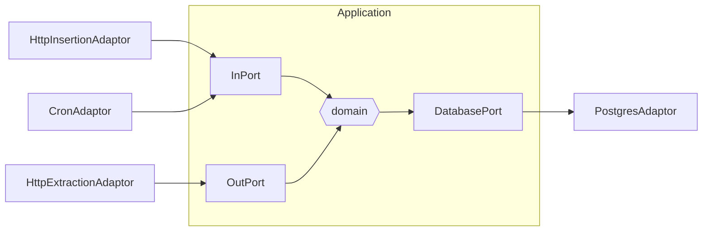
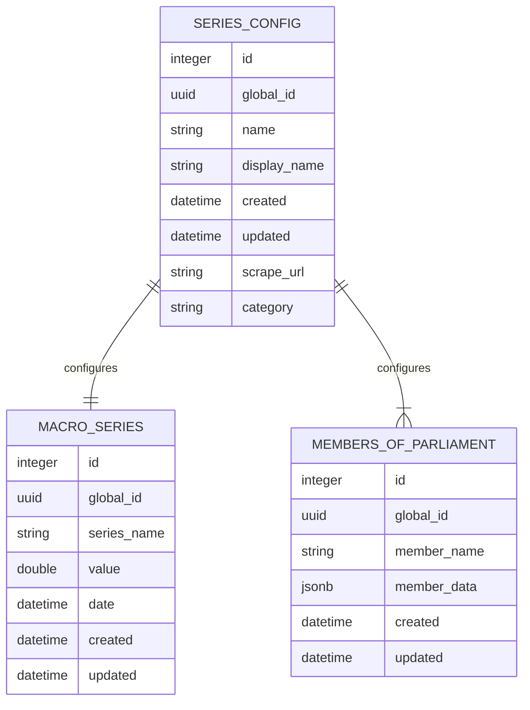

## marco-analyzer

Java backend application for macro-hub. Built using domain driven design principles and the
hexagonal architecture.



### Data Model



### Sources

- [Riskbanken REST API](https://www.riksbank.se/sv/statistik/sok-rantor--valutakurser/hamta-rantor-och-valutakurser-via-api/)
- [Riskbanken series](https://www.riksbank.se/sv/statistik/sok-rantor--valutakurser/oppet-api/serier-for-webbservices/)
- [Hexagonal architecture](https://medium.com/ssense-tech/hexagonal-architecture-there-are-always-two-sides-to-every-story-bc0780ed7d9c)
- [Commit message guidelines](https://gist.github.com/robertpainsi/b632364184e70900af4ab688decf6f53)
- [Kafka with microk8s](https://medium.com/@prasanta.mohanty/deploy-kafka-cluster-on-microk8s-in-15-mins-f3d5081991e8)

### Maven

generate jooq model

```
mvn -P jooq-codegen generate-sources
```

run flyway migration

```
mvn -Dflyway.url=jdbc:postgresql://localhost:31274/macroanalyzer \
    -Dflyway.user=macrouser \
    -Dflyway.password=macropassword \
    flyway:migrate
```
